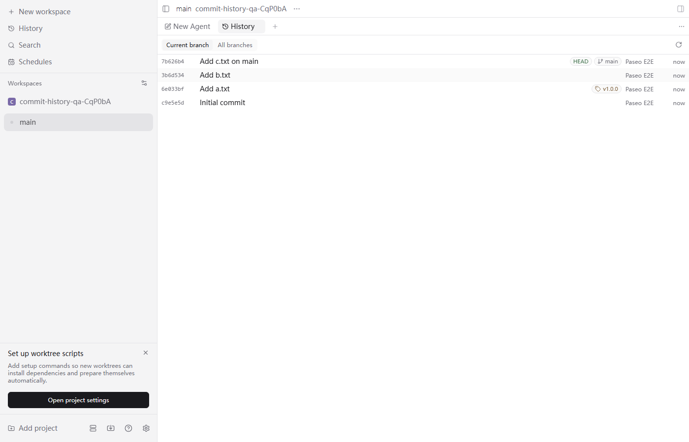
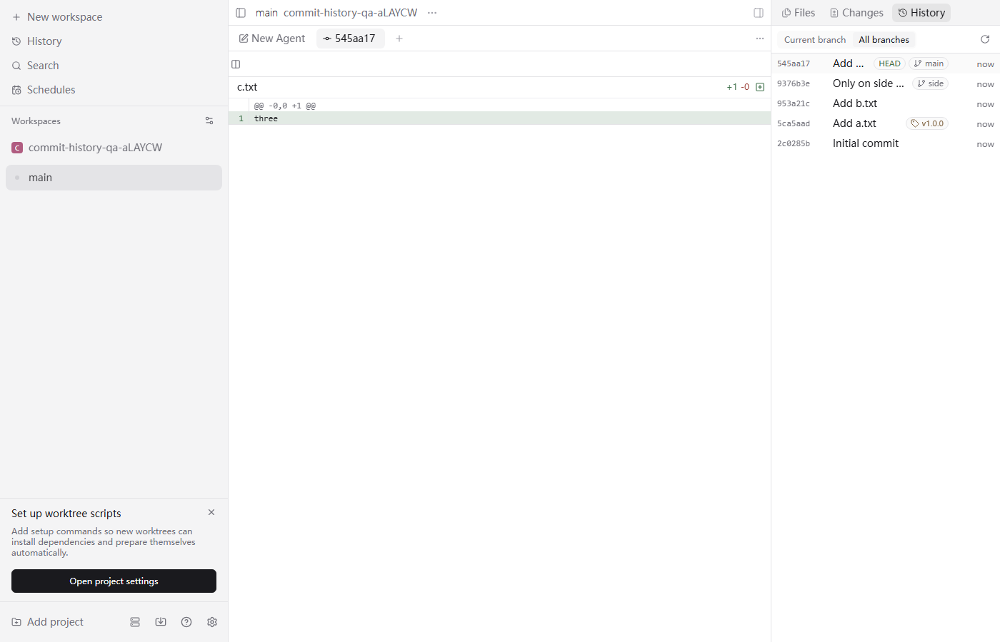

# paseo-commit-history

A [Paseo](https://paseo.sh) plugin that adds a **History** workspace panel: browse the full commit
log of a checkout, not just the commits ahead of base that the built-in Changes panel shows.

- A branch graph down the left edge: one lane per line of development, merges fanning out and
  folding back in, a halo on the checked-out commit, hollow nodes for merges.
- Current-branch or all-branches scope (local, remote-tracking, and tags).
- Short SHA, subject, ref badges, relative time, and author on wide panes.
- Cursor-based paging that survives force-pushes: when a pinned starting commit disappears the
  list reloads from the top instead of splicing in a shifted page.
- Opens the commit in Paseo's own commit-diff tab when the host supports it; older hosts copy the
  SHA instead.
- Reachable from the Explorer panel menu, the New Tab launcher, and the Command Center
  ("Open commit history").

## Requirements

A Paseo daemon and app with workspace panels in the Explorer menu (`main` after getpaseo/paseo#4446;
shipping in 0.8). The manifest currently declares `>=0.7.2` only because the 0.8 development daemon
still reports `0.7.2`; it will be raised to `>=0.8.0` when 0.8 is released.

Opening a commit from the panel needs a host that exposes `navigation.openCommitDiff` to plugins
([getpaseo/paseo#4460](https://github.com/getpaseo/paseo/pull/4460)). Until then a row press copies
the SHA.

The History panel as a workspace tab:



In the Explorer, with all-branches scope, and a row press opening the commit diff:



## Install

```bash
paseo plugin add CN-liuzhiyang/paseo-commit-history
```

or from a local checkout:

```bash
paseo plugin install /absolute/path/to/paseo-commit-history
```

Plugins are unsandboxed code: the server half runs `git` on the daemon host with the daemon
user's access.

## Develop

`@getpaseo/plugin` 0.8 is not on npm yet, so `npm install` runs `scripts/link-sdk.mjs`, which
symlinks the SDK from a sibling Paseo checkout (`../paseo`, or `PASEO_CHECKOUT`) whose
`packages/plugin` has been built with `npm run build:plugin`. Once 0.8 is published, replace that
script with a normal devDependency.

```bash
npm install
npm run typecheck
npm test            # vitest; the server tests create throwaway git repositories
paseo plugin install "$PWD"
paseo plugin reload commit-history   # after edits
paseo plugin logs commit-history
```

## Layout

| Path                         | Runtime | What                                                           |
| ---------------------------- | ------- | -------------------------------------------------------------- |
| `shared/commit-log.ts`       | both    | The `commit-log.list` RPC contract and entry types             |
| `server/commit-log.ts`       | daemon  | `git log` paging with pinned-tip cursors                       |
| `server/list-commit-log.ts`  | daemon  | RPC handler; resolves the workspace directory on the daemon    |
| `client/history-panel.tsx`   | app     | The panel: scope toggle, refresh, list, load states            |
| `client/commit-graph.ts`     | app     | Lane layout: which lane each commit sits in and where lines go |
| `client/commit-graph-cell.tsx` | app   | Paints one row's slice of the graph with plain views           |
| `client/use-commit-log.ts`   | app     | Infinite query with expired-cursor reset                       |
